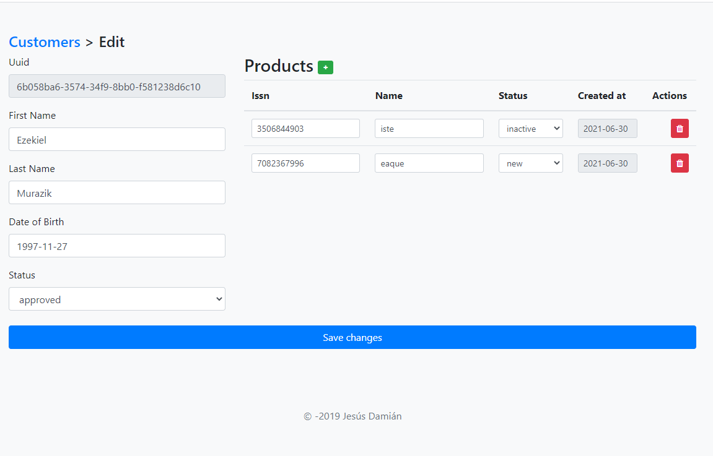

# Candonga

Candonga show you how to make a complete RESTful application in Laravel. Also it use another great Laravel benefits to customize API responses and log it requests and responses.

## Installation

Install PHP dependencies
```
$ composer install
```

Copy .env file
```
$ cp .env.example .env
```

Generate app key

```
$ php artisan key:generate
``` 

Create a fresh database
```sql
CREATE DATABASE candonga; 
```

Create database user
```sql
CREATE USER ´user´@´localhost´ IDENTIFIED BY ´YourP@ssword´; 
```

Add all privileges to new user
```
GRANT ALL ON candonga.* TO ´user´@´localhost´;
```

Configure Laravel database connection in .env 

```
DB_DATABASE=candonga
DB_USERNAME=user
DB_PASSWORD=YourP@ssword
```

Create database schema and run seeds
```
$ php artisan migrate --seed
```

Publish vendors
```
$ php artisan vendor:publish --tag=candonga --force
```

## Usage
Run server
```
$ php artisan serve
```

## Features

The config file allow you to decide if logged or not API requests and responses. It is locate in `config/candonga.php`

There are tow Monolog channels to store logs: *file* and *database*. By default both are used in an stacked channel named `api`. You can find them in `novadaemon/candonga/config/channels.php`

Candonga has a Laravel command to search products in 'pending' status for a week or more. Take advantage of Laravel's notifications to send an email to the admin user. Check how to use it by typing in the console:
```
$ php artisan products:pending --help
```

## Screenshot


## View in live
https://candonga.herokuapp.com


